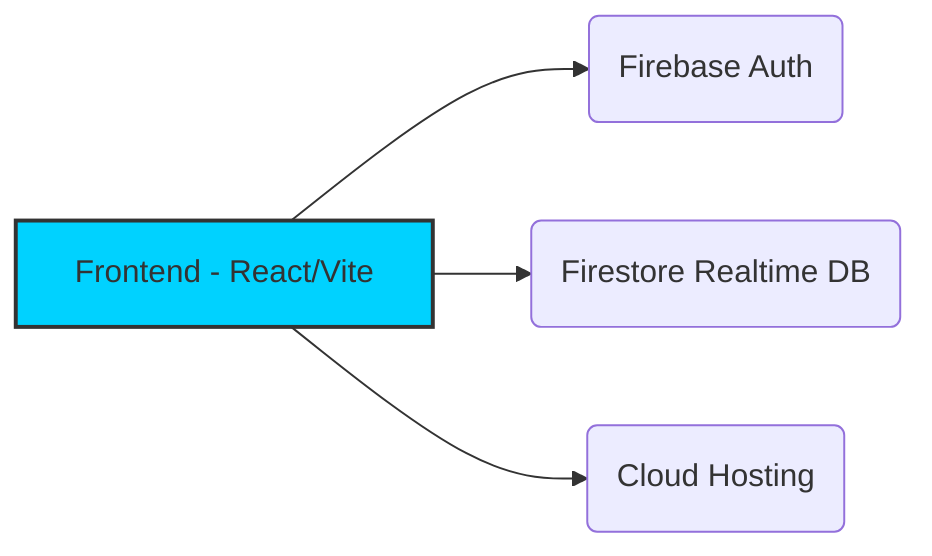

  
  
  

### ⚡ The Future of Academic Management
**Modern • Fast • Secure**

[**Explore Website**](https://tugas-pro.web.app/) • [**Documentation**](https://github.com/tugaspro/tugas-pro-app) • [**Report Bug**](https://github.com/tugaspro/tugas-pro-app/issues)

---

## 💎 Core Values
Kami membangun **TugasPro** dengan fokus pada pengalaman pengguna yang luar biasa:

<table border="0">
  <tr>
    <td>
      
      <b>Speed First</b> 
      Optimasi performa maksimal untuk akses instan tanpa hambatan.
    </td>
    <td>
      
      <b>Data Privacy</b> 
      Keamanan data pengguna adalah prioritas utama dalam setiap baris kode.
    </td>
  </tr>
  <tr>
    <td>
      
      <b>Mobile Ready</b> 
      Pengalaman PWA yang mulus di perangkat Android maupun iOS.
    </td>
    <td>
      
      <b>Cloud Sync</b> 
      Data tersimpan aman dan tersinkronisasi secara real-time antar perangkat.
    </td>
  </tr>
</table>

---

## 🏗️ Technical Architecture
Visualisasi sederhana bagaimana sistem **TugasPro** bekerja:

 

  

📈 Engineering Stats

Statistik pengembangan organisasi yang terpantau secara transparan:

   

🤝 Contributors

Terima kasih kepada para pengembang yang telah membantu memajukan platform ini:

  

 

 Built with ❤️ by <b>TugasPro Team</b>. © 2025 All rights reserved.    

